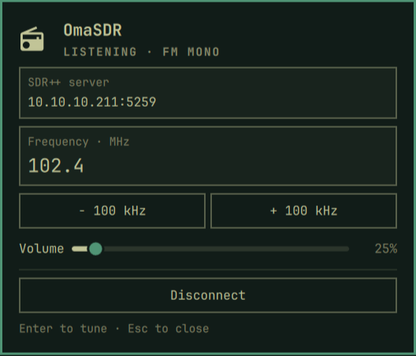

# OmaSDR

A small FM radio client for the Omarchy bar. Connect to an **SDR++ native
server**, tune a frequency, and listen through the desktop's default audio
output. The QML panel belongs to Omarchy's existing shell; a bundled Rust
executable handles the network stream, FM demodulation, and playback.

The panel follows Omathought's visual language: the shared Omarchy icon/title
header, muted status, thin bordered rows, flat controls, and theme fonts and
colors. The bar stays a radio icon, with a small indicator while listening.



Version 1.0.0 supports **mono broadcast FM**, 65–108 MHz, with European 50 µs
de-emphasis. Enter either `102.4` or `102,4`. The −/+ buttons tune in 100 kHz
steps. Volume affects only the radio. Closing the panel keeps audio playing;
Disconnect, disabling the plugin, or unloading it stops reception.

## Install

For **x86-64 Omarchy with the Quattro shell**. The plugin includes
`bin/omasdr`; users do not install Rust, compile anything, or install extra
packages. It uses the shell's Qt Quick Controls and the normal Omarchy
PipeWire/PulseAudio audio stack (`libpulse-simple.so.0`, `libpulse.so.0`) plus
standard Linux system libraries. It is not a standalone static Linux binary.

```sh
omarchy plugin add https://github.com/marvreichmann/omasdr --enable
```

The prebuilt executable is committed with executable permissions: Omarchy clones
the repository and does **not** execute installers or build hooks.

To install a locally built archive instead, extract the
`omasdr-<version>-linux-x86_64.tar.gz` that `scripts/build.sh` writes to
`dist/` into `~/.config/omarchy/plugins/`. It contains a `marv.omasdr/`
folder. Then run:

```sh
omarchy plugin validate ~/.config/omarchy/plugins/marv.omasdr
omarchy-shell shell rescanPlugins
omarchy plugin enable marv.omasdr
```

## Listen

1. Click the radio icon in the bar.
2. Enter the server as `host:port` (SDR++ normally uses port `5259`).
3. Enter a frequency in MHz and press Connect.
4. Press Enter after editing a frequency, or use −/+. Adjust Volume as needed.
5. Press Escape or click outside to close the panel. Use Disconnect to stop.

The server must already have a working radio source selected and a sample rate
between 240 kHz and 20 MHz. This client leaves source selection, gain, and
sample-rate configuration to SDR++. SDR++ normally permits one client at a
time; disconnect other clients first. This is the native SDR++ server protocol,
not rtl_tcp, SpyServer, or an audio streaming URL.

The initial server is `127.0.0.1:5259`, frequency `102.4`, and volume `30%`.
Panel edits last for the current widget instance. Optional `server`,
`frequency`, and `volume` settings in this widget's `shell.json` bar entry
override those starting values. It never connects automatically on load.

```sh
omarchy-shell shell summon marv.omasdr '{}'
omarchy-shell shell hide marv.omasdr
omarchy plugin disable marv.omasdr
omarchy plugin enable marv.omasdr
omarchy plugin remove marv.omasdr
```

## Build and verify (developers only)

Develop in this repository. Copy only the packaged folder to the user plugin
directory for testing; never edit Omarchy's packaged source.

Build requirements: x86-64 Linux, Rust 1.88+ with Cargo, PulseAudio development
linker files (Arch's `libpulse`), Python 3.11+, and Omarchy for plugin validation.
Cargo downloads the locked Rust dependencies on the first build. There are no
runtime downloads, install hooks, privileged operations, background services,
or separately installed SDR drivers.

```sh
cargo test --locked
cargo clippy --locked --all-targets -- -D warnings
bash scripts/build.sh
bash scripts/lint-qml.sh
```

`scripts/build.sh` creates `bin/omasdr`, its checksum/build metadata and third
party notices, `dist/marv.omasdr/`, and a versioned archive. Keep `bin/omasdr`,
`bin/SHA256SUMS`, `bin/build-info.json`, and `licenses/` in the published repo.
The archive includes the Rust source, lockfile, tests, and build scripts.

Tests cover fragmented/invalid packets, busy-server handling, start/tune/stop
commands, the QML control pipe, FM tone recovery at several input rates, and
stereo-pilot rejection. Integration tests open local TCP sockets.

For a bounded live test (the WAV path must not already exist):

```sh
bin/omasdr --server HOST:5259 --frequency 102.4 --seconds 12 --wav /tmp/fm-test.wav
```

`--no-audio` tests decoding without an audio device. Backend stdout contains
JSON status and sample/drop counters. The panel sends newline-delimited JSON
over stdin: `{"frequency":102.4}`, `{"volume":0.3}`, `{"stop":true}`. EOF stops
the backend, except during an explicit `--seconds` test. WAV capture is a
developer diagnostic, not a plugin UI feature.

## Scope and implementation

The Rust receiver requests uncompressed signed 16-bit IQ, decodes SDR++'s
sample framing, applies staged anti-alias and channel filters, demodulates FM,
filters mono audio to 15 kHz, applies 50 µs de-emphasis, and resamples to 48 kHz
with a fractional-delay filter bank. A bounded audio queue prevents memory and
latency growth if the audio device stalls. Errors appear in the panel.

No spectrum/waterfall, scanning, presets, RDS, stereo, narrow FM, AM, SSB,
source-control UI, or automatic reconnect is included. No packets are sent
outside the server chosen by the user; SDR++ connections are plain TCP.

The [sdrtop project](https://github.com/musithang/sdrtop) informed the initial
Rust/DSP investigation. Its implementation is not copied or linked. Wire
compatibility was checked against SDR++'s
[protocol definitions](https://github.com/AlexandreRouma/SDRPlusPlus/blob/master/core/src/server_protocol.h)
and sample framing. QML integration follows the
[Omarchy development guide](https://plugins.omarchy.org/develop.html).
The visual reference is [Omathought](https://github.com/marvreichmann/omathought).
Rust dependency licenses are included in `licenses/`.

## Publishing

See [PUBLISHING.md](PUBLISHING.md) for the release checklist. Building here does
not publish a repository or submit a marketplace listing.
